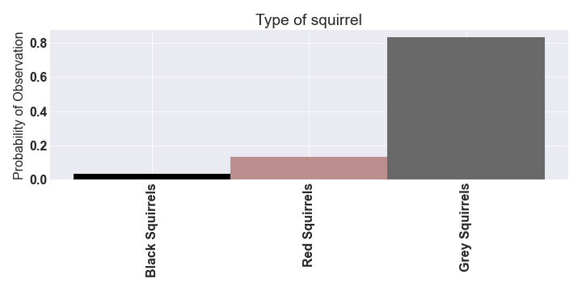
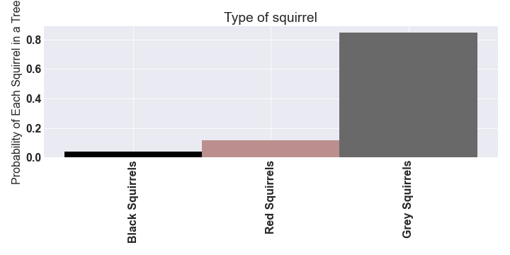
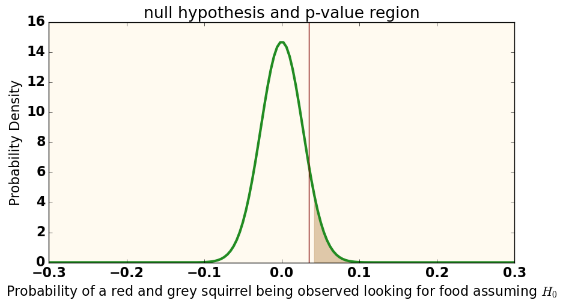
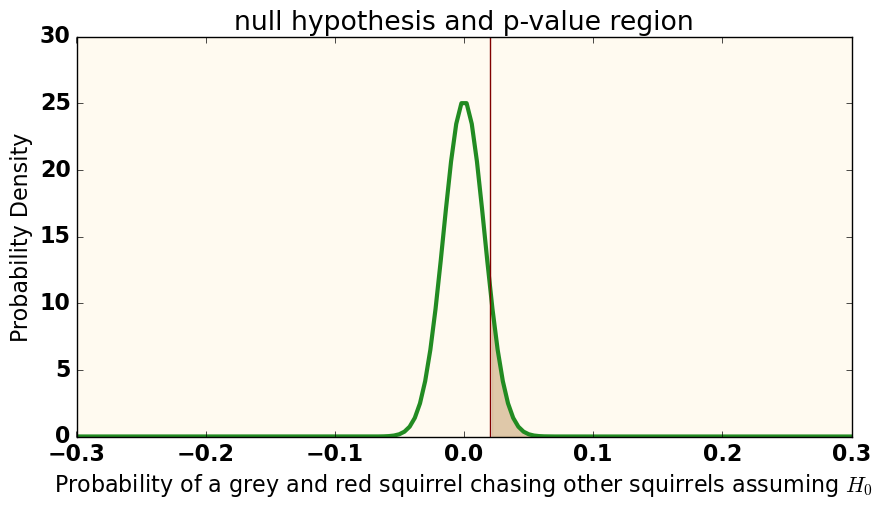
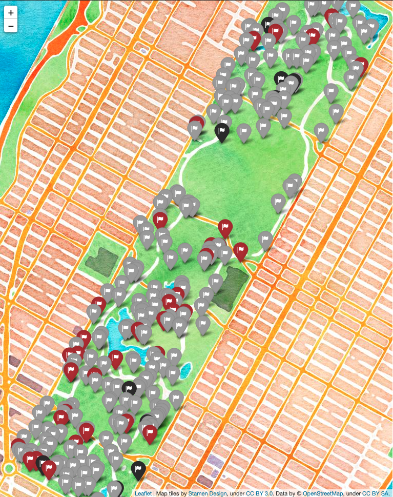
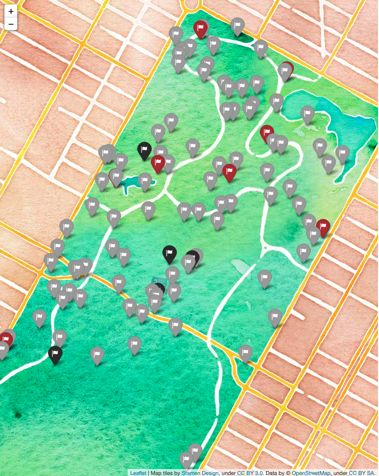
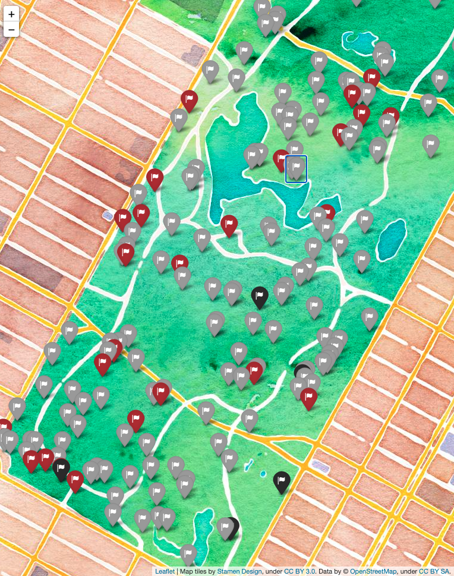

# Where my squirrels at?

  

In 2018, a group of 323 volunteers made a count of the central park squirrels, noting their position, AM or PM shift, the characteristics of the squirrel, what the squirrel was doing and how the squirrel interacted with humans.
This project aims to summarize the data into actionable advice for befriending those squirrels.

## Part 1:
### When and where should I look for squirrels

  

Of 3023 squirrel sighted, 2968 squirrels had information recorded and these are the squirrels that are used in this project.

*it is of note that 35 times a volunteer just wanted to say they saw a squirrel and that's all.*

  

Squirrels are more likely to be in trees in the morning

*threshold=0.021, diff=0.092, p_value=0.000*

  

Squirrels are also more likely to be indifferent to humans in the morning

*threshold=0.024, diff=0.112, p_value=0.000*

  

## Part 2:
### Which kind of squirrel would I like to be friends with?

Grey Squirrels Vastly Outnumber Red or Black Squirrels

|Likely Color of Observed Squirrel           |  Likely Color of Observed Squirrel that was in a tree   *    
:------------------------------------------------------------------:|:------------------------------------------------------------------: 
| | 

 *The probability of a squirrel being black given it was observed in a tree is P(B|T)=P(T|B)P(B)/P(T), the likelyhood could then be updated with volunteers that specifically looked in trees.*

This work focused on determining squirrel characteristics by group.  Observations of squirrels were divided by the number of squirrels of a specific type to compare frequency of observations between types.  A shared frequency was used to compare groups to determine statistical relevance of the data.

  

  

The null hypothesis = the probability of squirrel activities are the same between types

The alternative hypothesis = we can tell what a squirrel will be seen doing by type

&alpha; = The probability that we're rejecting the null hypothesis when the null hypothesis is true. **Set at 0.1 for this work.**

|Type 1 Error **False Positive** Incorrectly rejecting the null hypothesis           |  Type 2 Error **False Negative** Incorrectly accepting the null hypothesis       
:------------------------------------------------------------------:|:------------------------------------------------------------------: 
| | 
|**Are red squirrels are more likely to be seen looking for food than grey squirrels?** |**Are grey squirrels are more likely to be chasing other squirrels than red squirrels?** 
|threshold=0.035, diff=0.039 &alpha;=0.1 | threshold=0.020, diff=0.020 &alpha;=0.1
|Probability of making seeing the difference in these observations by chance = p value=0.073(|Probability of seeing the difference in these observations by chance p value=0.107 

## Part 3:
### So, you have a target, how do you approach

The data was sorted by position and then one out of every ten squirrels was marked on the graph.  (To prevent artificial affects of clustering from random data)

Full View Of Park             |  Northside          |  Southside
:-------------------------:|:-------------------------:|:-------------------------:  
  |  | 

  

Squirrels are more likely to be found on the ground in general, but if you would like to increase your probability of having the squirrel you're looking at be a black one, look in trees.
*threshold=0.06, diff=0.06, p_value=0.10*

  

**Disclaimer** *If a squirrel doesn't want to be friends with you, that's their problem.  Focus on squirrels that put in the effort*

|Approach Plan Grey Squirrels           |  Approach Plan Red Squirrels          |  Approach Plan Black Squirrels
:-------------------------:|:-------------------------:|:-------------------------:  
|Grey squirrels are more likely to be indifferent to you than black squirrels|red squirrels are more likely to approach you than grey squirrels|black squirrels more likely than red squirrels to run away
|*threshold=0.064, diff=0.066, p_value=0.09500*  | *threshold=0.016, diff=0.061, p_value=0.000*|*threshold=0.03, diff=0.09, p_value=0.03*
| **More likely to focus on squirrels.  Form an aliance (but take care not to seem threatening)** | **Food motivated.  Bring treats** | **Skittish, take a patient approach**

# Actionable Steps
Look for squirrels in the afternoon and pick out the type of squirrel most likely to be the kind of friend you want.  Keep an eye on the aggressiveness of the grey squirrels if you make more than one squirrel friend.

Look on the south side of the park for red squirrels, target the pockets of black squirrels throughout the park, or take a general approach and look for one of the abundant grey squirrels.

Make a plan to approach the squirrel based on their likely interaction.

# Next steps

Find the most diverse route through the park and determine the distance a person is likely to walk before having each kind of squirrel approach for friendship.

The dataset may be found here:
https://data.cityofnewyork.us/Environment/2018-Central-Park-Squirrel-Census-Squirrel-Data/vfnx-vebw